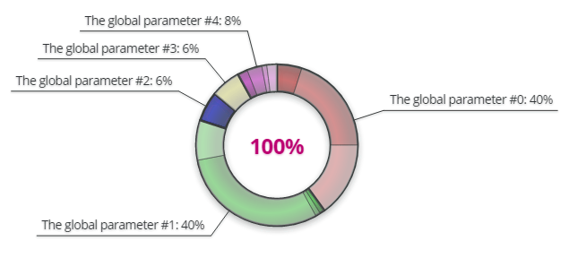
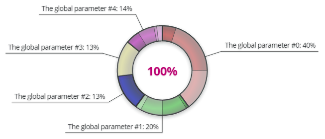
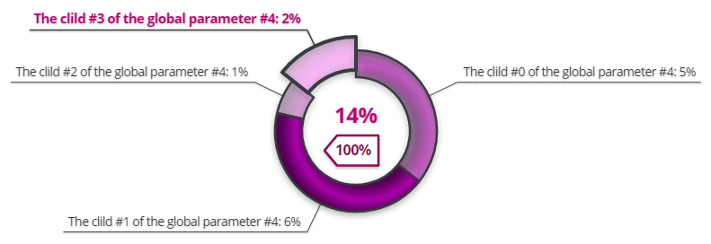
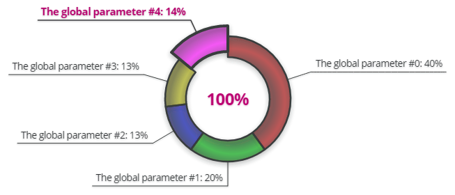
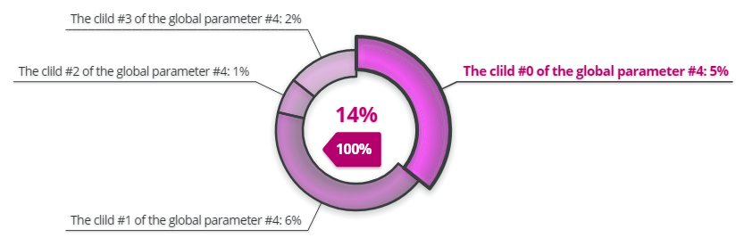
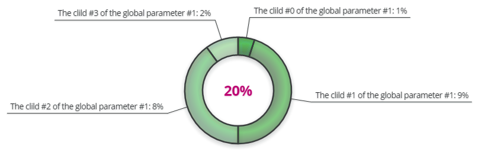
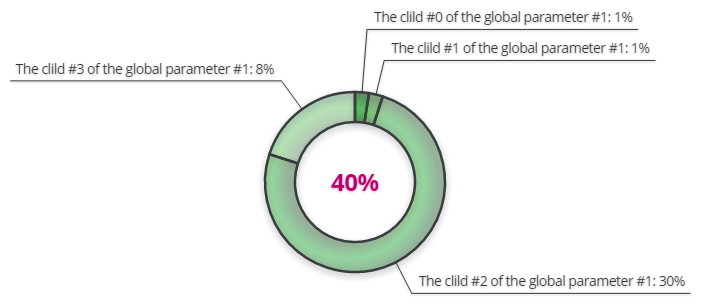

# Демонстративное приложение "Кольцевая диаграмма" (RingDiagram)

## Назначение программы
Это веб-приложение для демонстрации кольцевой диаграммы, созданной с помощью AngularJS.

## Средства разработки
- **Среда разработки**: Sublime Text, Google Chrome, Mozilla Firefox.
- **Языки программирования**: JavaScript (ECMAScript 5), HTML 4 и 5, CSS2 и 3.
- **Внешние библиотеки**: Snap.svg (библиотека для работы с SVG-изображениями).
- **Среда запуска**: Google Chrome или Mozilla Firefox.

## Описание программы
Кольцевая диаграмма отображает данные, разделённые по категориям и подкатегориям.
Реализовано 3 режима:
1. категории + подкатегории;
2. только внешние категории;
3. подкатегории заданной категории.

Разработаны алгоритмы:
- анимации вращения сияющего кольца (движение центра радиального градиента по траектории окружности);
- формирования выносных линий с подписями категорий и подкатегорий;
- выдвижения сегмента кольца при его выборе перехода из общего кольца категорий в кольцо подкатегорий заданной категории и обратно.

Хранение настроек - в стандартных и пользовательских CSS-свойствах.

Веб-страница содержит 3 кольцевых диаграммы и 4 кнопки.
Все кнопки делают одно и то же, но их 4, чтобы во время демонстрации при разглядывании диаграмм не приходилось бы прокручивать страницу.
Все 3 диаграммы отображают один и тот же текущий набор данных.

Всего определено 2 тестовых набора данных, и какой-то из них является набором данных в текущий момент.
По нажатию на одной из кнопок текущий набор данных изменяется.
Набор данных представляет собой данные для категорий и подкатегорий.

У каждой категории есть название и значение.
В сумме все значения всех категорий соответствуют 100%.
У категорий могу быть подкатегории.

Каждая подкатегория имеет название и значение.
Сумма всех значений всех подкатегорий также соответствует 100%, и категория, не имеющая подкатегорий, автоматически считается собственной единственной подкатегорией.

Базовыми данными является набор названий категорий и подкатегорий.
Для него подбираются наборы значений.
В данном примере есть 2 набора значений.
Таким образом, из базового набора названий и из двух наборов значений появляются 2 набора данных с одинаковыми названиями и разными значениями.
Эти данные как раз меняются по нажатию на кнопки.

Недостающие значения дополняются, неверные - пересчитываются.
Для каждой категории в диаграммах предусмотрен свой цвет.
Подкатегории в пределах категории окрашиваются в более светлые тона цвета своей категории.

**Первая диаграмма** - общая. Изначально на ней видны все категории с подкатегориями.
**Вторая диаграмма** - общая, без детализации. На ней видны все категории без подкатегорий.
**Третья диаграмма** показывает подкатегории одной из категорий, окрашенной в зелёный цвет.

### Первая диаграмма
Выносные линии с подписями указывают на категории.
Если кликнуть по кольцевому сегменту категории или по подписи на выносной линии, то осуществится переход в дочернее кольцо - кольцо подкатегорий выбранной категории, подобное третьей диаграмме, за исключением того, что в центре диаграммы имеется кнопка, при клике на которую происходит обратный переход к общей диаграмме, где показаны все категории, разделённые на подкатегории.

При клике на кольцевом сегменте подкатегории или по подписи на выносной линии в дочернем кольце категории выносная линия выделится, её подпись укрупнится и изменит цвет, а сегмент кольца выдвинется.
Повторный клик по элементам выбранной подкатегории (сегменту кольца или подписи у выносной линии) приведёт к возвращению выносной линии, подписи и сегмента в исходное состояние.
Если при наличии выбранной подкатегории выбрать другую категорию, то прежняя категория станет неактивной и выберется новая.

### Вторая диаграмма
Реакция на выбор категории такая же, как на выбор подкатегории в дочернем кольце в первой диаграмме.

### Третья диаграмма
Идентична дочернему кольцу первой диаграммы, за исключением того, что нет кнопки перехода в общее кольцо, где показаны все категории, разделённые на подкатегории.

## Сайт для тестирования проекта
https://katekotova.github.io/RingDiagram/

## Статус проекта
Проект завершён.

## Контакты
Котова Екатерина Александровна,
e-mail: katekotova_86@mail.ru